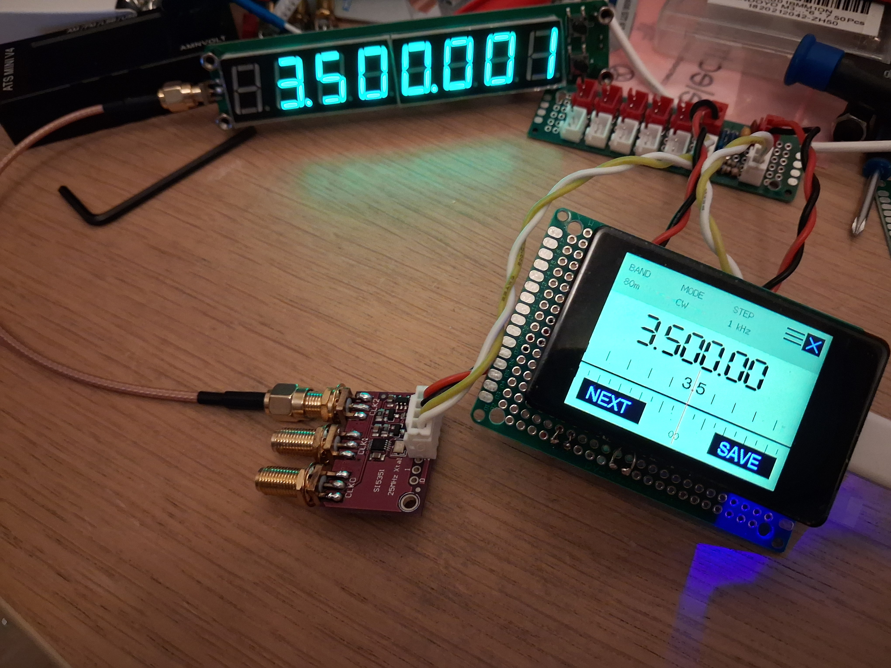

# VFO Studio Adaptive V2.1

### @fehabox

**Touch VFO • Adaptive Display • Personal Editions**

> **Don't change the radio. Change the design.**

VFO Studio Adaptive is a touch-oriented VFO platform designed around the
idea that the user interface can change without changing the underlying
radio.
<p align="center">
  
</p>
The V2.1 Personal release provides two firmware editions: **Free** and
**Personal Pro**.

---

## V2.1 Personal Editions

| Feature | Free Edition | Personal Pro |
|---|:---:|:---:|
| Touch VFO operation | ✓ | ✓ |
| SI5351 / VFO functions | ✓ | ✓ |
| Bands / Modes / Steps | ✓ | ✓ |
| AUTO tuning | ✓ | ✓ |
| BFO / V-BFO | ✓ | ✓ |
| Frequency calibration | ✓ | ✓ |
| Memory functions | ✓ | ✓ |
| Design system | ✓ | ✓ |
| Design slots | **2** | **10** |
| USB Serial | — | ✓ |
| Scanner | — | ✓ |
| Bluetooth | Future | Future |
| Wi-Fi / TCP | Future | Future |

### Free Edition

The Free Edition provides the core Touch VFO functionality and **two
design slots**.

- Free to distribute
- **Not for resale**
- No USB Serial communication
- No scanner
- Two design slots
- Full Touch VFO and design system

### Personal Pro

Personal Pro expands the platform with:

- **10 design slots**
- USB Serial communication
- Scanner
- Full Touch VFO and design system
- Future upgrade path for Bluetooth, Wi-Fi/TCP and other communication
  features

Future communication features are planned upgrades and should not be
considered available unless included in a later firmware release.

---

# Tested Hardware

VFO Studio Adaptive V2.1 has been **tested and verified** on:

### Waveshare ESP32-S3-Touch-LCD-2

**Standard version — without camera**

- ESP32-S3
- 2-inch touch display
- 240 × 320 display
- Integrated capacitive touch
- Standard board configuration
- **No camera**

Official hardware page:

**[Waveshare ESP32-S3-Touch-LCD-2](https://www.waveshare.com/esp32-s3-touch-lcd-2.htm)**

> **Important:** VFO Studio Adaptive V2.1 has been tested on this specific
> Waveshare board and display configuration. Other ESP32-S3 boards or
> display variants may require different hardware configuration and are
> not covered by this validation.

---

# Firmware

Current firmware:

```text
VFO_STUDIO_ADAPTIVE_V2_1.merged.bin
```

The supplied firmware is a **merged binary image** intended to be flashed
from address:

```text
0x0
```

---

# Flashing

The recommended and tested flashing method is **Espressif esptool**.

The repository/package includes a Windows batch file:

```text
FLASH_VFO_STUDIO_ADAPTIVE_V2_1.bat
```

The batch file performs:

1. Check for `esptool.exe`
2. Check for the firmware binary
3. Erase the ESP32-S3 flash
4. Flash the merged firmware at `0x0`
5. Report the result

### Tested flashing configuration

```text
Chip:       ESP32-S3
Firmware:   VFO_STUDIO_ADAPTIVE_V2_1.merged.bin
Address:    0x0
Baud:       921600
Test port:  COM9
Tool:       esptool.exe
Status:     TESTED / WORKING
```

The COM port can be changed in the BAT file if Windows assigns a
different port:

```bat
set "PORT=COM9"
```

For example:

```bat
set "PORT=COM7"
```

---

# Flash Package

A complete Windows flashing package contains:

```text
VFO_STUDIO_ADAPTIVE_V2_1.merged.bin
esptool.exe
FLASH_VFO_STUDIO_ADAPTIVE_V2_1.bat
README.md
```

Keep the firmware, BAT file and `esptool.exe` in the same folder.

---

# Touch Operation

The main tuning area is divided into two equal touch zones.

| Touch | Function |
|---|---|
| Left half of dial | Frequency DOWN |
| Right half of dial | Frequency UP |
| Short touch | One tuning step |
| Press and hold | Continuous tuning |
| Menu / hamburger | Open menu |
| Doors | Quick-access functions |

## AUTO Tuning

AUTO provides fine-to-fast tuning from the same touch control.

```text
Short click       → 1 Hz
Slight hold       → 100 Hz
Longer hold       → 1 kHz
Longer hold       → 10 kHz
Continue holding  → Fast AUTO
Release           → Reset
```

The next touch starts again at the fine 1 Hz level.

---

# Main Menu

The main menu provides access to functions such as:

- Band
- Mode
- Step / AUTO
- BFO
- Calibration
- Design
- Other firmware functions

The menu is touch operated and can be vertically scrolled.

---

# BFO Adjustment

BFO adjustment is independent of normal VFO tuning.

- **Short touch:** return without saving
- **Long press:** save

This makes it possible to enter BFO adjustment, decide not to keep the
change, and return without committing it.

---

# Frequency Calibration

The Calibration function allows the VFO frequency to be adjusted using
a measured/reference frequency.

Calibration is handled separately from normal VFO tuning.

---

# Design System

VFO Studio separates the **radio function** from the **visual design**.

Design elements include:

- Layout
- Frequency counter
- Counter font
- Dial
- Meter
- Status
- Theme
- Design slots
- Brightness

Changing a design changes the presentation, not the underlying radio
functions.

> **Don't change the radio. Change the design.**

---

# Design Slots

Design slots store different visual configurations.

### Free

```text
2 design slots
```

### Personal Pro

```text
10 design slots
```

A design slot does not represent a different radio. It represents a
different user interface configuration.

---

# Meter System

The meter system separates the measurement type from its visual
presentation.

Depending on the installed firmware/design, meter functions can
represent:

- S-meter
- dB
- Voltage
- Level / Strength
- SWR
- Power
- Current
- Linear
- VU

Visual styles can include analog, arc and LED/block presentations.

---

# Scanner

Scanner functionality is included in **Personal Pro**.

The scanner uses the existing VFO functions and operates according to
the selected frequency range and step configuration.

The Free Edition does not include the scanner.

---

# USB Serial

USB Serial communication is included in **Personal Pro**.

It provides an external command/control interface for compatible
software and supported VFO Studio commands.

The Free Edition does **not** include USB Serial communication.

---

# Smart URC

The **@fehabox Smart URC** application can be used with compatible
VFO Studio communication interfaces to learn supported commands and
provide an external control interface.

USB Serial control requires **Personal Pro**.

Free Edition firmware has no USB Serial communication.

---

# Future Development

VFO Studio Adaptive is designed as an expandable platform.

Future Personal Pro communication upgrades may include:

- Bluetooth Classic SPP
- Wi-Fi
- TCP/IP
- Wi-Fi discovery
- Additional remote-control capabilities

These features are planned/future capabilities and are not part of the
V2.1 Personal release unless explicitly included in a later firmware
build.

---

# Documentation

The project includes a VFO Studio Touch V2.1 Personal User Guide
covering:

- Touch operation
- Tuning
- AUTO mode
- Menu operation
- BFO
- Calibration
- Design system
- Design slots
- Meter operation
- Scanner
- Free vs Personal Pro
- USB Serial
- Operating workflow

---

# Hardware Link

VFO Studio Adaptive V2.1 was developed and tested using the:

**[Waveshare ESP32-S3-Touch-LCD-2](https://www.waveshare.com/esp32-s3-touch-lcd-2.htm)**

This link points to the standard version of the board used for testing,
**without camera**.

> **Affiliate disclosure:** If this hardware link becomes an affiliate
> link, @fehabox may receive a commission from qualifying purchases at
> no additional cost to the buyer.

---

# Important Compatibility Note

The V2.1 firmware is validated on the **Waveshare ESP32-S3-Touch-LCD-2
standard version with the integrated display and touch controller**.

Compatibility with other boards, displays, camera variants or custom
ESP32-S3 hardware has not been established by this V2.1 validation.

---

# License / Distribution

### Free Edition

The VFO Studio Adaptive V2.1 Free Edition is:

- Free to distribute
- Not for resale

### Personal Pro

Personal Pro is a separate personal-use firmware edition with expanded
features including USB Serial, scanner and additional design slots.

Refer to the project distribution terms accompanying the specific
firmware release.

---

# Project Philosophy

VFO Studio is built around a simple idea:

> **Atoms → Molecules → Modules → System → Platform**

and:

> **Don't duplicate. Compose.**

The Adaptive platform applies the same principle to the user interface:
the radio hardware remains the foundation while the display design can
change around it.

---

## VFO Studio Adaptive V2.1

**@fehabox**

**Touch VFO • Adaptive Platform • Personal Editions**

> *Don't change the radio. Change the design.*
